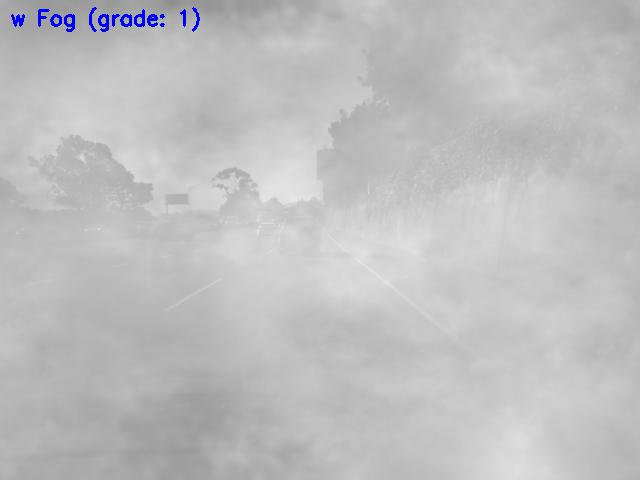

# Image Quality Grading 

## Remote Sensing Passive vs. Active

To have your deep learning models perform properly in noisy environments it is critical to understand what is the noise grade in the target environment. This will allow your system to decide how to behave according to the existing noise.

 

In this notebook I describe how to grade the effects in the environment using cameras (as passive sensors). However, the technique is applicable to activate sensor data as well.  
Next, I will show how to use this information to manage the deep learning models on a device in real-time more effectively to keep the object detection/classification accuracy as high as possible.

In this notebook you will see the following:

    
    

    
<ul>
  <li>Use numpy built-in FFT to transform images to frequency domain. </li>
  <li>Use numpy built-in fftShift to shift the low/high frequency components. </li>
  <li>use numpy built-in inverse FFT to reconstruct the shifted images.</li>
  <li>Observe the difference and grade the noise in the environment accordingly.</li>    
</ul> 

 
 
 
 
 
 
 
 
 

References:

[Imgaug for augmenting test images:](https://github.com/aleju/imgaug)

[Test images src](https://github.com/commaai/speedchallenge)

[Blurr detection using OpenCV](https://www.pyimagesearch.com/2020/06/15/opencv-fast-fourier-transform-fft-for-blur-detection-in-images-and-video-streams/)

     

    
    

